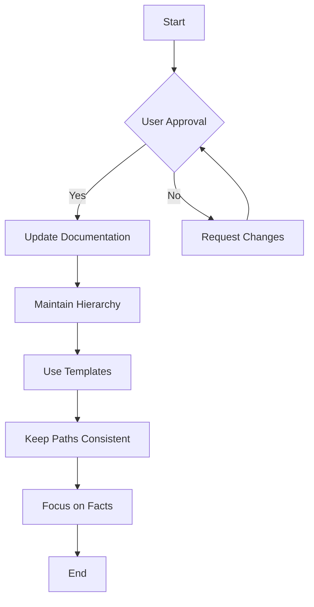
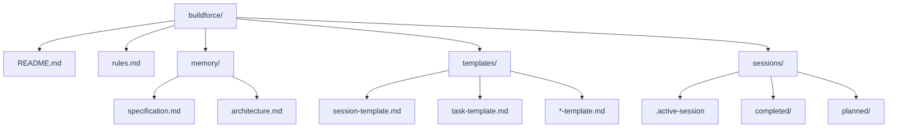
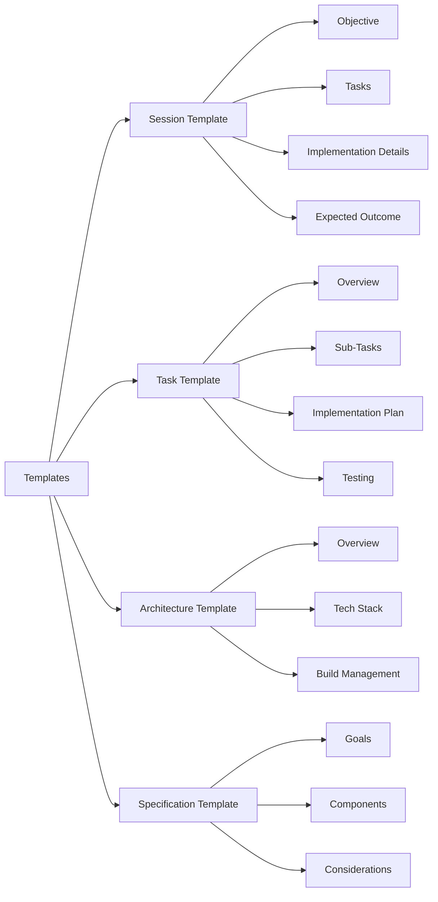
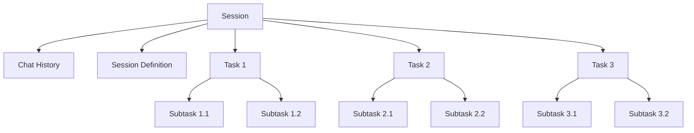
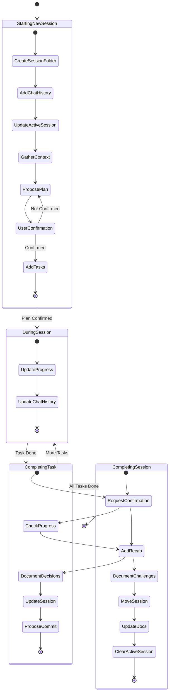
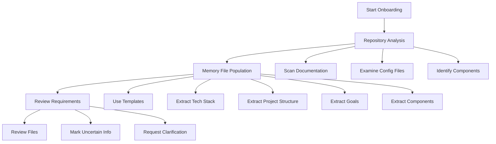
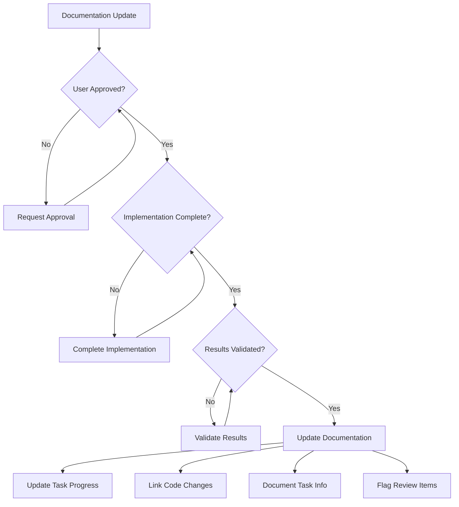
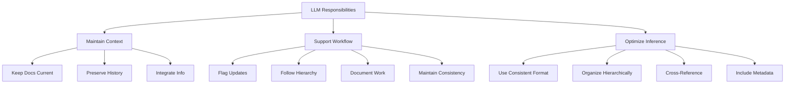

# BUILDFORCE RULES FOR LLM INFERENCE

## CRITICAL GUIDELINES

> **ALWAYS follow these rules when working with Buildforce projects**
>
> 1. Only update documentation after user approval and validation
> 2. Maintain hierarchical organization (session → task → subtask)
> 3. Focus on factual information from the codebase, not speculation
> 4. Use templates consistently with required sections fully completed
> 5. Keep paths and references consistent with existing project structure



## FILE SYSTEM STRUCTURE

```
buildforce/
├── README.md                # Main directory guide
├── rules.md                 # This file - rules for LLMs
├── memory/                  # Project intelligence
│   ├── specification.md     # Project requirements and vision
│   └── architecture.md      # Technical architecture and patterns
├── templates/               # Document templates
│   ├── session-template.md  # For session planning
│   ├── task-template.md     # For task definition
│   └── *-template.md        # Other supporting templates
└── sessions/                # Development tracking
    ├── .active-session      # Points to current active session
    ├── completed/           # Completed sessions and tasks
    └── planned/             # Planned sessions and tasks
```



## TEMPLATE USAGE RULES

- **ALWAYS** use appropriate template when creating new documents
- **NEVER** modify template structure or remove required sections
- **FILL ALL** required fields in templates with factual information



## HIERARCHICAL STRUCTURE

### Session → Task → Subtask Relationship

```
Session (session-template.md)
├── Chat History (.chat-history.md)
├── Session Definition (session.md)
├── Task 1 (task-template.md)
├── Task 2 (task-template.md)
└── Task 3 (task-template.md)
```



### Single Session Organization

```
sessions/planned/session-<number>-<name>/           # e.g. session-001-initial-setup/
├── .chat-history.md                               # Complete chat history for the session
├── session.md                                     # Session specification and overview
└── tasks/                                         # Task definitions
    ├── task-001-<name>.md                        # e.g. task-001-project-setup.md
    ├── task-002-<name>.md                        # e.g. task-002-dependency-config.md
    └── task-<number>-<name>.md                   # Additional tasks
```

### Naming Conventions

- **Session Folders**: `session-<3-digit-number>-<kebab-case-name>`

  - Example: `session-001-initial-setup`
  - Example: `session-042-enhance-plan-command`

- **Task Files**: `task-<3-digit-number>-<kebab-case-name>.md`

  - Example: `task-001-project-setup.md`
  - Example: `task-002-implement-core-features.md`

- **Required Files**:
  - `.chat-history.md`: Maintains complete conversation history
  - `session.md`: Contains session specification
  - All task files must be in the `tasks/` subdirectory

### Chat History Format

```markdown
# Chat History

## <ISO-8601-timestamp> | User

User message content

## <ISO-8601-timestamp> | Assistant

Assistant response content
```

### Session Components

- **Sessions**: Development period with specific objective

  - MUST contain tasks
  - MUST have clear expected outcomes

- **Tasks**: Concrete work within a session

  - MUST belong to a session
  - MUST have implementation details
  - MAY have subtasks

- **Subtasks**: Granular work items
  - MUST belong to a task
  - MUST be trackable (checkbox format)

## TASK MANAGEMENT WORKFLOW

1. **Starting New Session**:

   - ADD initial session folder (with a descriptive short name and the next iterative number - ex. "session-002-task-management") in `sessions/planned/` and a new session.md file in it. USE [session-template.md](./templates/session-template.md) for the file structure!
   - ADD a `.chat-history.md` and keep it updated as the conversation progresses
   - UPDATE `.active-session` with the relative path to the session that the user is starting
   - GATHER context from the user about the session they are about to start
   - PROPOSE a plan for the session based on the context and the session template
   - REQUEST user confirmation on the plan
   - IF the user confirms the plan
     - ADD the planned tasks in the session's `tasks/` folder. USE [task-template.md](./templates/task-template.md) for the file structure!
     - UPDATE the session.md file with the plan
   - ELSE keep iterating on the plan until the user confirms it

2. **During Session**:

   - UPDATE task progress (check completed subtasks)
   - UPDATE chat history (each row should be either a user or assitant message following the (timestamp | role | message) structure)

3. **Completing Task**:

   - REQUEST user confirmation on each completed task
   - MAKE sure that all progress checkboxes are checked in the task file
   - ADD Recap section with summary of work in the task file
   - DOCUMENT key decisions (if any) in `session.md` of the active session
   - UPDATE `session.md` by marking the task as completed
   - PROPOSE a commit message for each completed task and encourage the user to commit the changes

4. **Completing Session**:

   - REQUEST user confirmation on the session completion
   - ADD Recap section with summary of work in `session.md`
   - DOCUMENT challenges, solutions, and key decisions in `session.md` of the active session
   - MOVE completed session from `planned/` to `completed/`
   - UPDATE [architecture.md](./memory/architecture.md) and [specification.md](./memory/specification.md) with the summary of this session
   - CLEAR `.active-session` file



## ONBOARDING PROCESS FOR NEW PROJECTS

1. **Repository Analysis**:

   - SCAN for documentation, README files, architecture diagrams
   - EXAMINE configuration files (package.json, Dockerfile, etc.)
   - IDENTIFY components, services, and applications

2. **Memory File Population**:

   - USE appropriate templates
   - EXTRACT from codebase (ONLY IF ENOUGH INFORMATION EXIST):
     - Tech stack → architecture.md
     - Project structure → architecture.md
     - Goals → specification.md
     - Components → specification.md

3. **Review Requirements**:
   - ALL files MUST be reviewed by human developer
   - MARK uncertain information clearly
   - REQUEST clarification on ambiguities



## DOCUMENTATION UPDATE RULES

### CRITICAL: Only update documentation when ALL are true:

1. User has approved the update
2. Implementation is complete and tested
3. Results are validated

### NEVER document:

- Proposals
- Work in progress
- Experiments
- Unconfirmed decisions

### ALWAYS:

- Update task progress (checkboxes)
- Link to relevant code changes
- Document task-specific information
- Flag items needing review
- Seek user approval before updating project docs



## LLM RESPONSIBILITIES

1. **Maintain Accurate Context**

   - KEEP project documents current and accurate
   - PRESERVE historical decisions and rationale
   - INTEGRATE new information appropriately

2. **Support Collaborative Workflow**

   - FLAG needed updates for user approval
   - FOLLOW correct paths and hierarchies
   - DOCUMENT only validated work
   - MAINTAIN consistency across all files

3. **Optimize for Future Inference**
   - USE consistent formatting
   - ORGANIZE information hierarchically
   - CROSS-REFERENCE related information
   - INCLUDE metadata for easier retrieval


